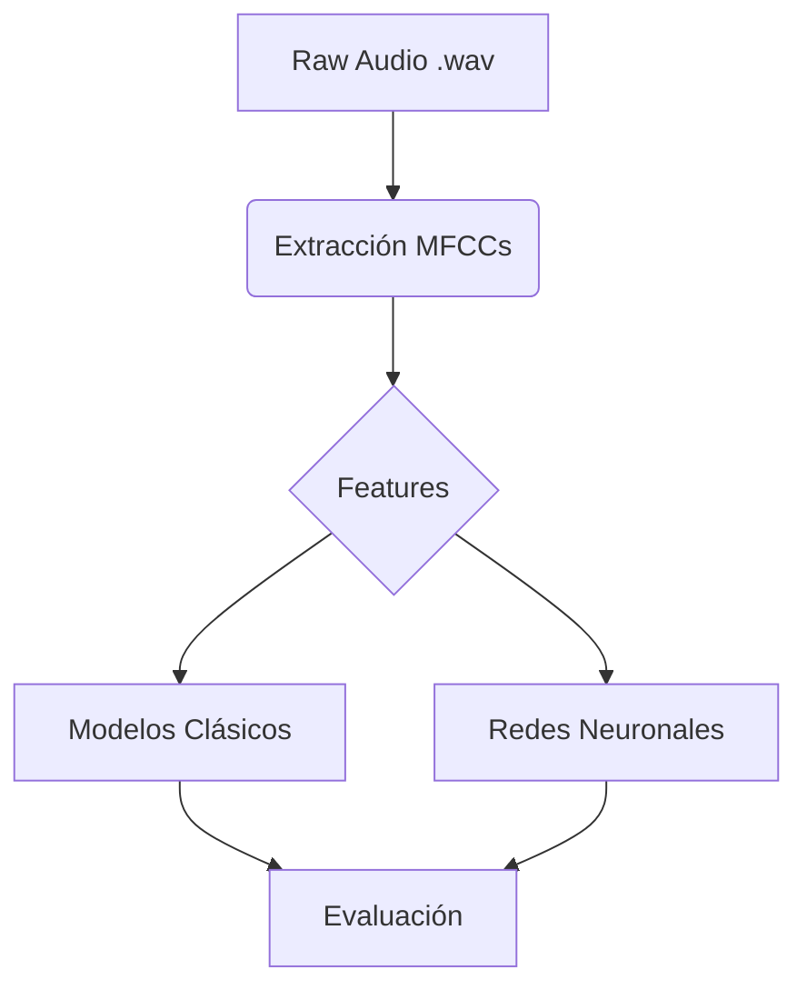
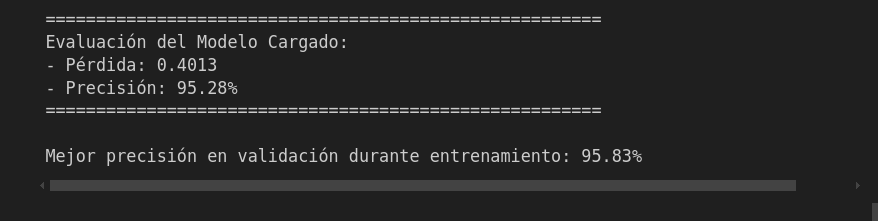

# Reconocimiento de emociones - Ravdess Dataset

[](https://creativecommons.org/licenses/by-nc-sa/4.0/)
[](https://www.python.org/)
[](https://jupyter.org/)

## Requisitos Técnicos

### Entorno de Desarrollo
```bash
# Sistema Operativo probado
- Ubuntu 24.04 LTS

# Gestión de entornos
- Conda >= 4.12
- Python 3.10.13

# Hardware recomendado
- CPU: Intel i7+ / AMD Ryzen 7+
- RAM: 16GB+ 
- Almacenamiento: 50GB libres
```

## Licencia y Uso

### Dataset RAVDESS

El **RAVDESS** es un conjunto de datos multimodal que contiene grabaciones de:
- **Discurso emocional** (1440 archivos)
- **Canto emocional** (1012 archivos)
- **Expresiones faciales** (video)
- **Movimientos corporales** (motion capture)

*Este proyecto utiliza exclusivamente el componente de **discurso emocional**.*

### Características Clave
| Parámetro              | Especificación                     |
|------------------------|------------------------------------|
| **Actores**            | 24 profesionales (12M/12F)        |
| **Idioma**             | Inglés (EEUU/Canadá)              |
| **Emociones**          | 8 estados emocionales:            |
|                        | - Neutral                         |
|                        | - Calma                           |
|                        | - Felicidad                       |
|                        | - Tristeza                        |
|                        | - Enfado                          |
|                        | - Miedo                           |
|                        | - Asco                            |
|                        | - Sorpresa                        |
| **Intensidad**         | 2 niveles: Normal, Fuerte         |
| **Duración**           | 3-4 segundos por audio            |
| **Formato**            | 48kHz, 16-bit, WAV               |
| **Condiciones**        | Estudio insonorizado, micrófono profesional |

### Estructura de Archivos
Cada archivo sigue la nomenclatura:
```bash
03-01-06-01-02-02-17.wav
```
Donde:
1. Modality (03): Modalidad (Modalidad de expresión)
2. Vocal Channel (01): Vocal channel (solo voz, no audiovisual)
3. Emotion (06): Emoción
4. Emotional Intensity (01): Intensidad emocional
5. Statement (02): Statement (frase pronunciada)
6. Repetition (02): Repetición
7. Actor (17): Actor

El Ryerson Audio-Visual Database of Emotional Speech and Song (RAVDESS) 
se distribuye bajo licencia Creative Commons Attribution-NonCommercial-ShareAlike 4.0 International (CC BY-NC-SA 4.0).

- Atribución REQUERIDA
- Uso NO comercial
- Derivados bajo misma licencia
- La licencia del dataset RAVDESS prevalece sobre cualquier uso de los datos

Más detalles: https://smartlaboratory.org/ravdess/


## Flujo de Trabajo

### 1. Configuración del Entorno
```bash
# Crear entorno Conda con Python 3.10
conda create -n emotion python=3.10.13
conda activate emotion

# Instalar dependencias principales
conda install -c conda-forge jupyterlab numpy pandas scikit-learn librosa matplotlib tensorflow=2.10
```

### 2. Preparación de Datos
```python
# Estructura de archivos RAVDESS (Actor_*/*.wav)
DATASET_PATH/
├── Actor_01/
│   ├── 03-01-01-01-01-01-01.wav
│   └── ...
└── Actor_24/
```

### 3. Procesamiento de Señales de Audio
```python
# Extracción de características (MFCCs + Delta)
for audio_file in dataset:
    X, sr = librosa.load(file, sr=22050, duration=3)
    mfccs = librosa.feature.mfcc(y=X, sr=sr, n_mfcc=40)
    delta = librosa.feature.delta(mfccs)
    features.append(np.vstack([mfccs, delta]).T)  # (time_steps, 80)
```

### 4. Ingeniería de Features
```python
# Padding para secuencias variables
X_padded = pad_sequences(features, maxlen=130, dtype="float32", padding="post")

# Split estratificado
X_train, X_test, y_train, y_test = train_test_split(
    X_padded, labels, test_size=0.25, stratify=labels
)
```

### 5. Desarrollo en Jupyter Notebook

Estructura del notebook:
1. Análisis exploratorio de datos (EDA)
2. Entrenamiento de modelos clásicos (Árboles, Random Forest)
3. Construcción de CNN 1D
4. Evaluación comparativa
5. Optimización de hiperparámetros

### 6. Arquitectura de Modelos
```python
# CNN 1D para series temporales
model = Sequential([
    Conv1D(256, 5, activation='relu', input_shape=(130, 80)),
    BatchNormalization(),
    MaxPooling1D(2),
    Dropout(0.3),
    Conv1D(128, 3, activation='relu'),
    GlobalMaxPooling1D(),
    Dense(64, activation='relu', kernel_regularizer=l2(0.01)),
    Dropout(0.5),
    Dense(8, activation='softmax')
])
```

### 7. Pipeline de Entrenamiento
```python
# Configuración de entrenamiento con early stopping
callbacks = [
    EarlyStopping(patience=15, restore_best_weights=True),
    ReduceLROnPlateau(factor=0.2, patience=5)
]

history = model.fit(
    X_train, y_train,
    batch_size=32,
    epochs=100,
    validation_data=(X_test, y_test),
    callbacks=callbacks
)
```

### 8. Evaluación de Modelos
```python
# Métricas clave
print(classification_report(y_test, y_pred, target_names=emotion_labels))

# Matriz de confusión interactiva
sns.heatmap(cm, annot=True, fmt="d", xticklabels=labels, yticklabels=labels)
```

### 9. Serialización de Modelos
```python
# Guardado en formato .joblib (modelos clásicos)
joblib.dump(model, "random_forest_v1.joblib") 

# Guardado en formato .h5 (TensorFlow)
model.save("emotion_cnn.h5")
```

### 10. Implementación de Inferencia
```python
class EmotionRecognizer:
    def __init__(self, model_path):
        self.model = load_model(model_path)
        self.le = joblib.load("label_encoder.joblib")
    
    def predict(self, audio_path):
        # Preprocesamiento en tiempo real
        features = extract_features(audio_path)
        return self.le.inverse_transform(self.model.predict(features))
```

## Diagrama de Flujo


### Resultado:

